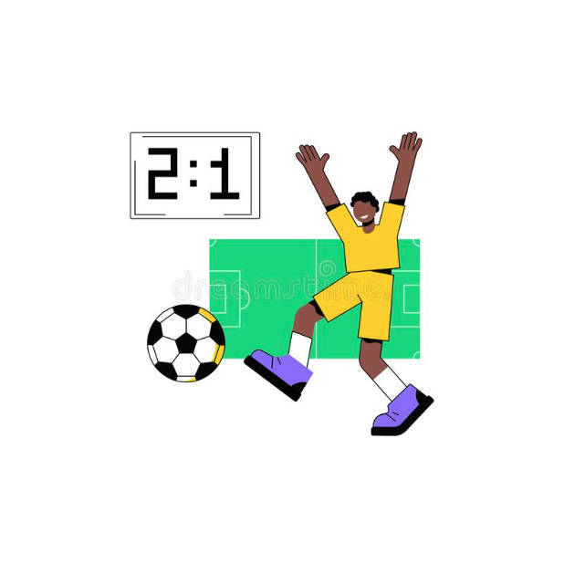

# Title: Soccer Match Predictor

## Project Description

Soccer (football) is one of the most highly respected sports worldwide. It brings together many nations and cultures as we saw in the previous 2022 World Cup. Every match, viewers test their luck and make predictions on whether which team will win a given soccer match. These predictions usually contain some bias as they want their favorite team to win, but it’s all for fun and entertainment in the end. But what if we could automate and accurately do this process?

Through this project, the aim is to be able to accurately predict both the winning team within a soccer match, as well as the final score. It will take factors such as team players, their individual and team form, the weather, home/ away advantage, etc. to make a sound decision. I hope to also include more in detail factors such as how well certain players play against the opposing team or specific opposing players and their current moods to make the best decision possible.

Because the world of soccer will come with a large dataset, I plan to use an algorithm that will be able to handle it: the Rain Forest Algorithm. This algorithm is also great for a project like this as it does not consider outliers, so “upset” matches (matches where the winning team was heavily not in favor of victory ends up winning) will not affect the training model.

Initially, the dataset trained may have to be limited to certain leagues/ divisions, but the overarching goal is to expand as much as possible.

## Project Goals
1. Being able to predict “upset” wins through finding a pattern within previous teams where the odds were stacked against them and they still won
2. Allow the data to be live and dynamically added, as the sports world is constantly changing.
2.5 Updating which players play on what team, player’s form, team’s overall form, etc.
3. Being able to accurately predict the scoreline instead of stating which team will win
4. 70% win accuracy
5. Get rich off of sports betting
